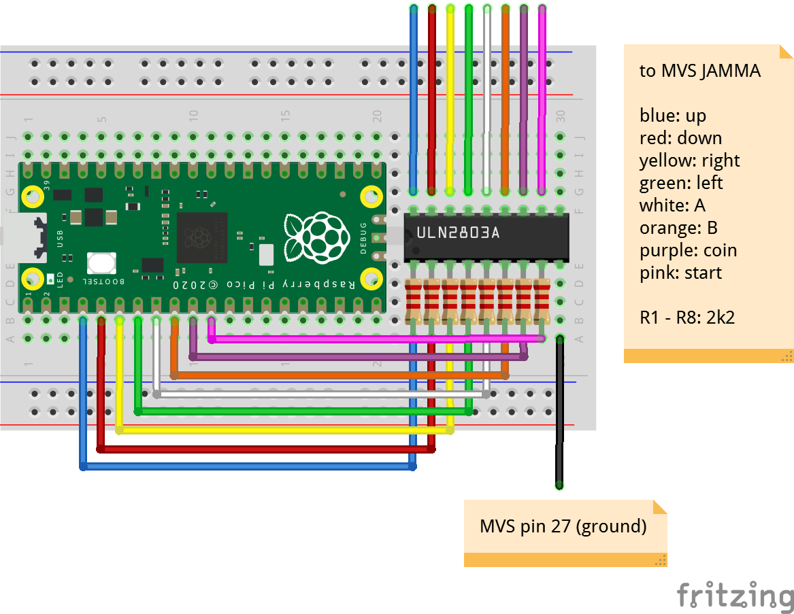

# MVS-to-USB
A NeoGeo MVS JAMMA to USB converter/adapter.

Connect any compatible HID joystick/gamepad to the Pi Pico micro-USB port, each report will be converted to a JAMMA logic level.

## 2 Buttons layout (Analog/DPAD + A,B)

